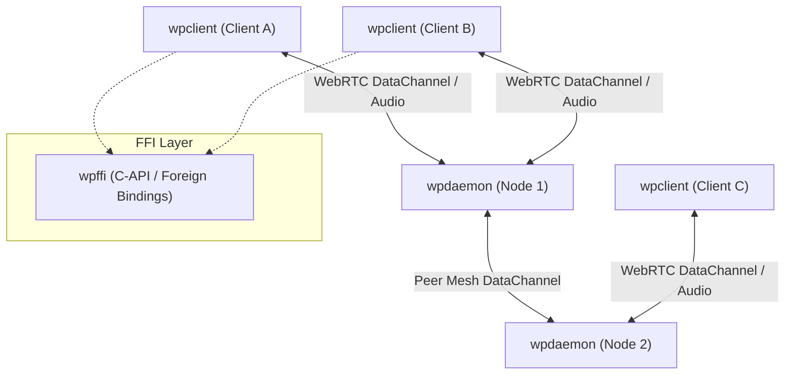

# WPIP-01: WPIP Architecture & Process

`draft` `optional` `author:haruki7049`

______________________________________________________________________

## Abstract

This document defines the goals, specification process, and overall system architecture for **WPIPs (web-phone Implementation Possibilities)** within the `web-phone` ecosystem.

The key words "MUST", "MUST NOT", "REQUIRED", "SHALL", "SHALL NOT", "SHOULD", "SHOULD NOT", "RECOMMENDED", "MAY", and "OPTIONAL" in this document are to be interpreted as described in [RFC 2119](https://www.ietf.org/rfc/rfc2119.txt).

______________________________________________________________________

## 1. System Architecture

`web-phone` is a decentralized, real-time WebRTC audio communication platform. The system consists of three core components:

### Component Roles

1. **`wpclient` (Client Application)**:

   - Manages audio capture (microphone) and audio playback (speakers) with resampling.
   - Executes WebRTC SDP signaling handshakes with a `wpdaemon` node.
   - Transmits and receives real-time audio packets and call control events over WebRTC DataChannel.

1. **`wpdaemon` (Daemon Server Node)**:

   - Provides HTTP signaling endpoints (`/sdp`, `/peer/sdp`, `/addresses`).
   - Hosts a built-in UDP STUN/TURN service for NAT traversal.
   - Maintains a thread-safe registry (`ClientRegistry`) of active client connections and routes 1-to-1 audio.
   - Interconnects with other `wpdaemon` nodes via peer mesh to relay audio across nodes.

1. **`wpffi` (Core Engine & FFI)**:

   - Provides C-compatible ABI interfaces (`extern "C"` functions, header `wpffi.h`).
   - Serves as the core library for non-Rust language bindings (Python, Go, Flutter, GUIs, etc.).

______________________________________________________________________

## 2. Address Identification (UserAddress)

Client identity in `web-phone` is represented by `UserAddress`:

- A 32-byte (64-character hexadecimal string) unique identifier.
- Dynamically generated from UNIX timestamps and SHA-256 hashes upon connection, or manually configured.
- Supports prefix-matching (Short ID) for address resolution and routing.

______________________________________________________________________

## 3. Design Principles

1. **Simplicity**:

   - Signaling relies on minimal HTTP POST requests (JSON/SDP).
   - Audio streaming and control events are multiplexed over a single WebRTC DataChannel.

1. **Privacy and Decentralization**:

   - Operates without centralized authentication servers. Anyone can run a `wpdaemon` node.
   - Peer mesh routing allows clients connected to different daemon nodes to communicate seamlessly.

1. **Interoperability**:

   - Language-agnostic C FFI (`wpffi`) enables embedding client and daemon capabilities into any environment.
