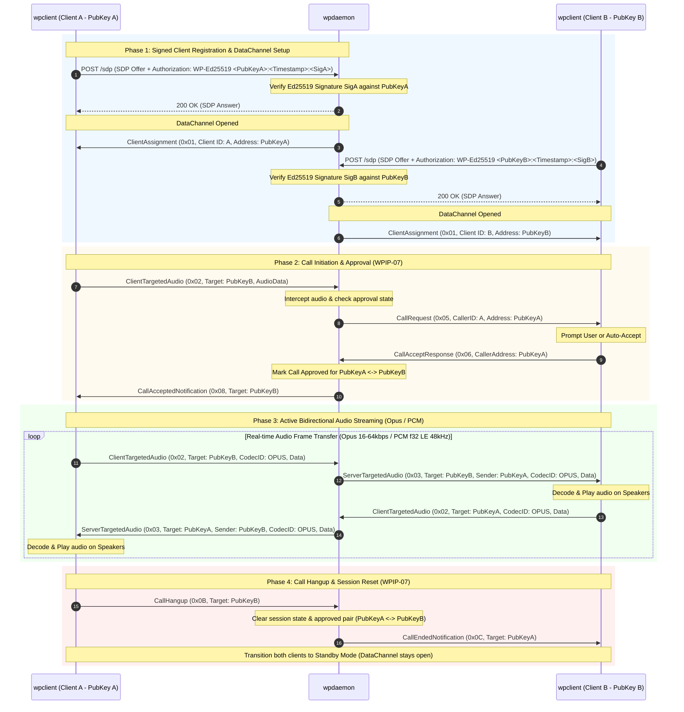

# WPIP-01: WPIP Architecture & Process

`draft` `optional` `author:haruki7049`

______________________________________________________________________

## Abstract

This document defines the goals, specification process, and overall system architecture for **WPIPs (web-phone Implementation Possibilities)** within the `web-phone` ecosystem.

The key words "MUST", "MUST NOT", "REQUIRED", "SHALL", "SHALL NOT", "SHOULD", "SHOULD NOT", "RECOMMENDED", "MAY", and "OPTIONAL" in this document are to be interpreted as described in [RFC 2119](https://www.ietf.org/rfc/rfc2119.txt).

______________________________________________________________________

## 1. System Architecture & Cryptographic Identity

`web-phone` is a fully decentralized, cryptographic real-time WebRTC audio communication platform. The system consists of three core components:

```mermaid
graph TD
    ClientA["wpclient (Client A - Ed25519 PubKey A)"] <-->|WebRTC DataChannel / Audio| Daemon1["wpdaemon (Node 1)"]
    ClientB["wpclient (Client B - Ed25519 PubKey B)"] <-->|WebRTC DataChannel / Audio| Daemon1
    Daemon1 <-->|Peer Mesh DataChannel (Node Signed)| Daemon2["wpdaemon (Node 2)"]
    ClientC["wpclient (Client C - Ed25519 PubKey C)"] <-->|WebRTC DataChannel / Audio| Daemon2

    subgraph FFI Layer
        FFI["wpapi (C-API / Foreign Bindings)"]
    end

    ClientA -.-> FFI
    ClientB -.-> FFI
```

### Component Roles

1. **`wpclient` (Client Application)**:

   - Manages an Ed25519 keypair (`SecretKey` / `PublicKey`) for cryptographic identity.
   - Manages audio capture (microphone) and audio playback (speakers) with resampling.
   - Executes signed WebRTC SDP signaling handshakes with a `wpdaemon` node.
   - Transmits and receives real-time audio packets and call control events over WebRTC DataChannel.

1. **`wpdaemon` (Daemon Server Node)**:

   - Provides HTTP signaling endpoints (`/sdp`, `/peer/sdp`, `/addresses`) with mandatory Ed25519 signature verification.
   - Hosts a built-in UDP STUN/TURN service for NAT traversal.
   - Maintains a thread-safe registry (`ClientRegistry`) of active client connections and routes 1-to-1 audio.
   - Interconnects with other `wpdaemon` nodes via peer mesh to relay audio across nodes.

1. **`wpapi` (Core Engine & FFI)**:

   - Provides C-compatible ABI interfaces (`extern "C"` functions, header `wpapi.h`).
   - Serves as the core library for non-Rust language bindings (Python, Go, Flutter, GUIs, etc.).

______________________________________________________________________

## 2. Cryptographic Identity (UserAddress)

Client and node identity in `web-phone` is represented by `UserAddress`:

- **Ed25519 Public Key**: A `UserAddress` MUST be the client's 32-byte Ed25519 Public Key (represented in text as a 64-character hexadecimal string).
- **Self-Sovereign Identity**: No central server or authority assigns IDs. Clients generate their own Ed25519 keypair locally.
- **Cryptographic Proof**: Clients MUST prove ownership of their `UserAddress` by producing valid Ed25519 signatures during signaling handshakes.
- **Short ID**: Supports prefix-matching (Short ID - e.g., first 12 hex characters) for address resolution and routing.

______________________________________________________________________

## 3. End-to-End Connection & Streaming Sequence Diagram

The following sequence diagram details the complete end-to-end workflow featuring mandatory Ed25519 signature verification during HTTP signaling:



______________________________________________________________________

## 4. Design Principles

1. **Self-Sovereign & Decentralized**:

   - Built on Ed25519 public-key cryptography. Operates without centralized authentication or identity servers.

1. **Simplicity**:

   - Signaling relies on minimal HTTP POST requests (JSON/SDP + Ed25519 Authorization header).
   - Audio streaming and control events are multiplexed over a single WebRTC DataChannel.

1. **Interoperability**:

   - Language-agnostic specifications allowing any language (Rust, Go, C++, Python, TypeScript) to implement compliant nodes.
