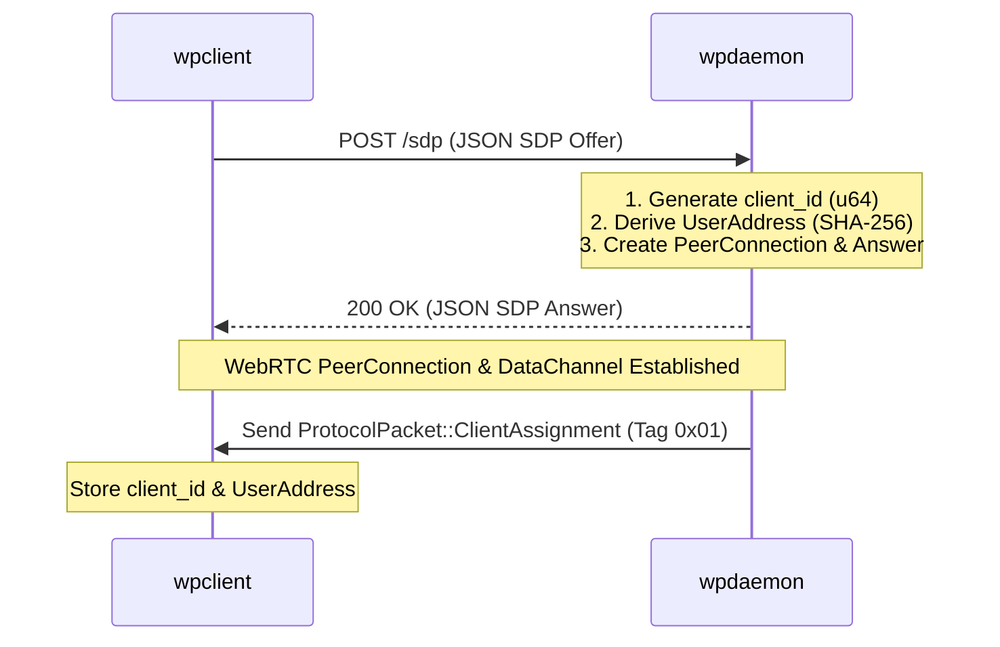

# WPIP-02: wpdaemon Core Specification

`draft` `mandatory` `author:haruki7049`

______________________________________________________________________

## Abstract

This specification defines the minimal **Core Specification** for a compliant **`wpdaemon`** server node in the `web-phone` network. Advanced features (STUN/TURN, Call Control, Peer Mesh) are defined in separate extension WPIPs.

The key words "MUST", "MUST NOT", "REQUIRED", "SHALL", "SHALL NOT", "SHOULD", "SHOULD NOT", "RECOMMENDED", "MAY", and "OPTIONAL" in this document are to be interpreted as described in [RFC 2119](https://www.ietf.org/rfc/rfc2119.txt).

______________________________________________________________________

## 1. Minimal Core Responsibilities

A compliant core `wpdaemon` implementation MUST satisfy only the following minimal requirements:

1. **HTTP/WebRTC Signaling (`POST /sdp`)**:
   - MUST accept WebRTC SDP Offers from clients and respond with a valid SDP Answer.
1. **Client Assignment (`ClientAssignment`)**:
   - MUST assign a unique 64-bit integer `client_id` and a 32-byte `UserAddress` to each connecting client.
   - MUST send `ProtocolPacket::ClientAssignment` (`0x01`) to the client immediately over DataChannel upon connection.
1. **Basic DataChannel Relay**:
   - MUST accept audio packets (`ClientTargetedAudio` - `0x02`) from clients and relay them to target clients (`ServerTargetedAudio` - `0x03`).
1. **Connection Cleanup**:
   - MUST unregister disconnected clients when their WebRTC PeerConnection terminates.

______________________________________________________________________

## 2. Detailed HTTP API & Concrete Payload Examples

A core `wpdaemon` MUST expose HTTP REST signaling endpoints.

### 2.1 `POST /sdp` (Client Handshake Endpoint)

- **HTTP Method**: `POST`
- **Path**: `/sdp`
- **Request Headers**: `Content-Type: application/json`

#### HTTP Status Codes

| Status Code | Description |
| :---: | :--- |
| `200 OK` | SDP Offer accepted; SDP Answer returned successfully. |
| `400 Bad Request` | Invalid SDP Offer syntax or corrupted JSON body. |
| `500 Internal Error` | Internal WebRTC PeerConnection or ICE gathering error. |

#### Concrete Request Payload Example

```json
{
  "type": "offer",
  "sdp": "v=0\r\no=- 142385928172 2 IN IP4 127.0.0.1\r\ns=-\r\nt=0 0\r\na=group:BUNDLE 0\r\nm=application 9 UDP/TLS/RTP/SAVPF 100\r\nc=IN IP4 127.0.0.1\r\na=setup:actpass\r\na=mid:0\r\na=sctp-port:5000\r\n"
}
```

#### Concrete Response Payload Example (`200 OK`)

```json
{
  "type": "answer",
  "sdp": "v=0\r\no=- 987654321012 2 IN IP4 127.0.0.1\r\ns=-\r\nt=0 0\r\na=group:BUNDLE 0\r\nm=application 9 UDP/TLS/RTP/SAVPF 100\r\nc=IN IP4 127.0.0.1\r\na=setup:active\r\na=mid:0\r\na=sctp-port:5000\r\n"
}
```

______________________________________________________________________

### 2.2 `GET /addresses` (Optional Directory Endpoint)

- **HTTP Method**: `GET`
- **Path**: `/addresses`
- **Response**: `200 OK`, `Content-Type: application/json`

#### Concrete Response Payload Example (`200 OK`)

```json
[
  {
    "id": "e3b0c44298fc1c149afbf4c8996fb92427ae41e4649b934ca495991b7852b855"
  },
  {
    "id": "8d969eef6ecad3c29a3a629280e686cf0c3f5d5a86aff3ca12020c923adc6c92"
  }
]
```

______________________________________________________________________

## 3. Handshake & Signaling Sequence Diagram

The following diagram illustrates the complete core connection and assignment flow between a `wpclient` and a `wpdaemon`:



______________________________________________________________________

## 4. Client State & Connection Registry (`ClientRegistry`)

A compliant `wpdaemon` MUST track active clients in a thread-safe registry (`ClientRegistry`) associating:

- `client_id` (64-bit uint)
- `user_address` (`UserAddress` - 32-byte hash)
- `peer_connection` (Arc/Pointer to WebRTC PeerConnection)
- `data_channel` (Arc/Pointer to WebRTC DataChannel)

### Unregistration Rules

When a PeerConnection's state changes to `Failed`, `Closed`, or `Disconnected`, `wpdaemon` MUST remove the associated `client_id` and all routing state from `ClientRegistry` to prevent stale data routing.

______________________________________________________________________

## 5. Optional Daemon Extensions

Implementations MAY support the following optional extensions defined in separate WPIPs:

- **STUN/TURN Service**: See [WPIP-07](WPIP-07.md) for embedded STUN/TURN server specifications.
- **Call Control & Capacity Constraints**: See [WPIP-08](WPIP-08.md) for 2-participant limits and call approval/rejection state management.
- **Inter-Daemon Peer Mesh**: See [WPIP-05](WPIP-05.md) for multi-daemon interconnection.
