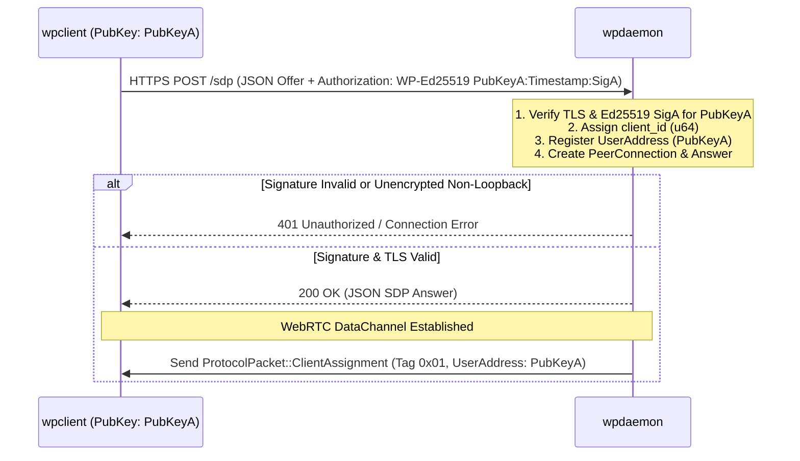

# WPIP-02: wpdaemon Core Specification

`draft` `mandatory` `author:haruki7049`

______________________________________________________________________

## Abstract

This specification defines the minimal **Core Specification** for a compliant **`wpdaemon`** server node in the `web-phone` network, featuring mandatory Ed25519 public-key signature verification and TLS/HTTPS transport security.

The key words "MUST", "MUST NOT", "REQUIRED", "SHALL", "SHALL NOT", "SHOULD", "SHOULD NOT", "RECOMMENDED", "MAY", and "OPTIONAL" in this document are to be interpreted as described in [RFC 2119](https://www.ietf.org/rfc/rfc2119.txt).

______________________________________________________________________

## 1. Minimal Core Responsibilities

A compliant core `wpdaemon` implementation MUST satisfy the following minimal requirements:

1. **Transport Security (TLS/HTTPS)**:
   - MUST serve all signaling endpoints (`POST /sdp`, `POST /peer/sdp`, `GET /addresses`) over HTTPS (TLS 1.2 or TLS 1.3) for external network communications.
   - Plaintext HTTP MUST NOT be used for external communications. Implementations MAY permit plaintext HTTP solely for loopback addresses (`127.0.0.1`, `::1`, `localhost`) for testing purposes.
1. **Mandatory Ed25519 Authentication (`POST /sdp`)**:
   - MUST verify the Ed25519 cryptographic signature in the HTTP `Authorization` header (`WP-Ed25519`) against the client's public key before accepting SDP Offers.
   - MUST reject unsigned or invalidly signed requests with `401 Unauthorized`.
1. **Client Assignment (`ClientAssignment`)**:
   - MUST assign a unique 64-bit integer `client_id` and register the client's verified 32-byte Ed25519 Public Key as their `UserAddress`.
   - MUST send `ProtocolPacket::ClientAssignment` (`0x01`) over DataChannel immediately upon connection.
1. **Basic DataChannel Relay**:
   - MUST accept audio packets (`ClientTargetedAudio` - `0x02`) from authenticated clients and relay them to target clients (`ServerTargetedAudio` - `0x03`).
1. **Connection Cleanup**:
   - MUST unregister disconnected clients when their WebRTC PeerConnection terminates.

______________________________________________________________________

## 2. Transport Security & HTTPS API Specifications

A core `wpdaemon` MUST expose HTTPS REST signaling endpoints.

### 2.1 Transport Layer Security (TLS 1.2 / TLS 1.3)

- **TLS Version**: All external HTTP endpoints MUST be encrypted with TLS 1.2 or TLS 1.3.
- **Certificates**: `wpdaemon` MAY utilize trusted CA certificates (e.g., Let's Encrypt) or self-signed certificates. If self-signed certificates are used, clients MUST verify the certificate fingerprint or explicitly accept self-signed certificates.
- **Loopback Exemption**: Plaintext `http://127.0.0.1` or `http://[::1]` MAY be allowed exclusively for local development and unit testing.

______________________________________________________________________

### 2.2 `POST /sdp` (Signed Client Handshake Endpoint)

- **HTTP Method**: `POST`
- **Path**: `/sdp`
- **Scheme**: `https://` (or `http://` on loopback only)
- **Request Headers**:
  - `Content-Type: application/json`
  - `Authorization: WP-Ed25519 <PubKeyHex>:<Timestamp>:<SignatureHex>` (MUST be present)

#### Signature Verification Rule

The signature MUST be calculated over the string:
`"<Timestamp>:<SDP_OFFER_STRING>"` using the client's Ed25519 secret key.

`wpdaemon` MUST verify that:

1. The timestamp is within acceptable drift (+/- 300 seconds from current server time).
1. The Ed25519 signature is cryptographically valid for `<PubKeyHex>`.

#### HTTP Status Codes

| Status Code | Description |
| :---: | :--- |
| `200 OK` | Signature valid; SDP Offer accepted; SDP Answer returned successfully. |
| `401 Unauthorized` | Missing, invalid, or expired Ed25519 signature in Authorization header. |
| `400 Bad Request` | Invalid SDP Offer syntax or corrupted JSON body. |
| `500 Internal Error` | Internal WebRTC PeerConnection or ICE gathering error. |

#### Concrete Request Example

```http
POST /sdp HTTP/1.1
Host: node.web-phone.dev:15000
Content-Type: application/json
Authorization: WP-Ed25519 e3b0c44298fc1c149afbf4c8996fb92427ae41e4649b934ca495991b7852b855:1757275200:a1b2c3d4e5f60708090011223344556677889900aabbccddeeff0011223344556677889900aabbccddeeff

{
  "type": "offer",
  "sdp": "v=0\r\no=- 142385928172 2 IN IP4 127.0.0.1\r\ns=-\r\nt=0 0\r\na=group:BUNDLE 0\r\nm=application 9 UDP/TLS/RTP/SAVPF 100\r\nc=IN IP4 127.0.0.1\r\na=setup:actpass\r\na=mid:0\r\na=sctp-port:5000\r\n"
}
```

#### Concrete Response Payload Example (`200 OK`)

```json
{
  "type": "answer",
  "sdp": "v=0\r\no=- 987654321012 2 IN IP4 127.0.0.1\r\ns=-\r\nt=0 0\r\na=group:BUNDLE 0\r\nm=application 9 UDP/TLS/RTP/SAVPF 100\r\nc=IN IP4 127.0.0.1\r\na=setup:active\r\na=mid:0\r\na=sctp-port:5000\r\n"
}
```

______________________________________________________________________

### 2.3 `GET /addresses` (Optional Directory Endpoint)

- **HTTP Method**: `GET`
- **Path**: `/addresses`
- **Scheme**: `https://`
- **Response**: `200 OK`, `Content-Type: application/json`

#### Concrete Response Payload Example (`200 OK`)

```json
[
  {
    "id": "e3b0c44298fc1c149afbf4c8996fb92427ae41e4649b934ca495991b7852b855"
  },
  {
    "id": "8d969eef6ecad3c29a3a629280e686cf0c3f5d5a86aff3ca12020c923adc6c92"
  }
]
```

______________________________________________________________________

## 3. Handshake & Signaling Sequence Diagram



______________________________________________________________________

## 4. Client State & Connection Registry (`ClientRegistry`)

A compliant `wpdaemon` MUST track active clients in a thread-safe registry (`ClientRegistry`) associating:

- `client_id` (64-bit uint)
- `user_address` (`UserAddress` - 32-byte Ed25519 Public Key)
- `peer_connection` (Arc/Pointer to WebRTC PeerConnection)
- `data_channel` (Arc/Pointer to WebRTC DataChannel)

### Unregistration & Resource Cleanup Rules

When a PeerConnection's state changes to `Failed`, `Closed`, or `Disconnected`, `wpdaemon` MUST remove the associated `client_id` and all routing state from `ClientRegistry`.

Furthermore, to prevent memory leaks from unestablished handshakes (e.g. clients sending `POST /sdp` but dropping ICE/DTLS transport before DataChannel setup), `wpdaemon` MUST enforce a maximum handshake timeout (RECOMMENDED: 30 seconds). Handshake sessions failing to establish DataChannel connectivity within this period MUST be automatically pruned and memory resources freed.

______________________________________________________________________

## 5. Short ID Address Resolution Rules

A compliant `wpdaemon` MUST support prefix-matching for `UserAddress` resolution:

- **Minimum Length**: Short ID prefix inputs MUST be at least **12 hexadecimal characters** (6 bytes / 48-bit prefix). `wpdaemon` MUST reject prefixes shorter than 12 hex characters.
- **Local Registry Resolution**: `wpdaemon` MUST search its local `ClientRegistry` for active `UserAddress` matching the prefix.
- **Ambiguity Enforcement**: If a Short ID prefix matches more than one registered `UserAddress`, `wpdaemon` MUST NOT select a candidate arbitrarily. `wpdaemon` MUST return an ambiguity error (`409 Conflict` in HTTP signaling or `AddressAmbiguousError`), requiring the client to specify a longer prefix or full 64-character hexadecimal address.

______________________________________________________________________

## 6. Optional Daemon Extensions

Implementations MAY support the following optional extensions defined in separate WPIPs:

- **STUN/TURN Service**: See [WPIP-06](WPIP-06.md) for embedded STUN/TURN server specifications.
- **Call Control & Capacity Constraints**: See [WPIP-07](WPIP-07.md) for 2-participant limits and call approval/rejection state management.
- **Inter-Daemon Peer Mesh**: See [WPIP-05](WPIP-05.md) for multi-daemon interconnection with signed HTTPS handshakes.
- **Group Call & SFU Extension**: See [WPIP-08](WPIP-08.md) for Selective Forwarding Unit (SFU) audio routing and Top-K speaker limits.
