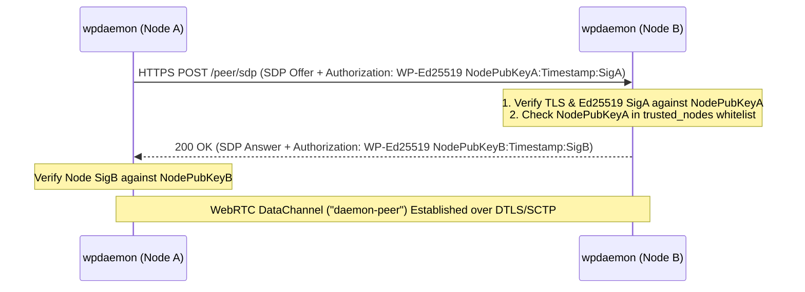

# WPIP-05: Inter-Daemon Peer Mesh Federation

`draft` `optional` `author:haruki7049`

______________________________________________________________________

## Abstract

This specification defines the **Inter-Daemon Peer Mesh Federation** protocol allowing multiple authenticated `wpdaemon` server nodes to interconnect and relay audio across distributed nodes using HTTPS TLS transport encryption, Ed25519 node signatures, and TTL (Time-To-Live) hop limits.

The key words "MUST", "MUST NOT", "REQUIRED", "SHALL NOT", "SHOULD", "SHOULD NOT", "RECOMMENDED", "MAY", and "OPTIONAL" in this document are to be interpreted as described in [RFC 2119](https://www.ietf.org/rfc/rfc2119.txt).

______________________________________________________________________

## 1. Node Identifiers & Cryptographic Identity

Each `wpdaemon` instance MUST maintain a unique Ed25519 keypair:

- **Node Identity**: A daemon's identity is represented by its 32-byte Ed25519 Public Key.
- **`node_id` (64-bit)**: Truncated 8-byte LE uint64 derived from the daemon's Ed25519 Public Key.
- **Node Collision Prevention**: Every daemon in a mesh network MUST have a distinct keypair and `node_id`.

______________________________________________________________________

## 2. Mutual Ed25519 HTTPS Interconnection Handshake

1. **Signed HTTPS Handshake**: Nodes configured with peer URLs (`--peer <URL>`) MUST issue an HTTP `POST /peer/sdp` over **HTTPS (TLS 1.2 / TLS 1.3)** containing an SDP Offer and a valid Ed25519 Authorization header (`Authorization: WP-Ed25519 <NodePubKeyHex>:<Timestamp>:<SignatureHex>`).
2. **Mutual Node Authentication**:
   - The receiving node (Node B) MUST verify Node A's Ed25519 signature `SigA` before generating an SDP Answer.
   - Node B MUST include its own Ed25519 Authorization header (`Authorization: WP-Ed25519 <NodePubKeyB>:<Timestamp>:<SigB>`) in the HTTP `200 OK` response payload/header.
   - Node A MUST verify Node B's signature `SigB` before accepting the SDP Answer, establishing **Mutual Node Authentication**.
3. **Trusted Node Whitelisting (`trusted_nodes`)**:
   - `wpdaemon` implementations MAY support a `trusted_nodes` whitelist configuration.
   - If `trusted_nodes` is configured, `wpdaemon` MUST reject SDP offers from node public keys not present in the whitelist with `403 Forbidden`.
4. **Dedicated DataChannel Transport Security**:
   - Authenticated nodes MUST establish a WebRTC DataChannel labeled `"daemon-peer"` for node-to-node relaying.
   - Transport encryption and packet integrity are guaranteed by the underlying WebRTC DTLS/SCTP layer; daemons MUST NOT re-sign individual audio packets on the wire to prevent CPU overhead.

______________________________________________________________________

## 3. Audio Relay, TTL Hop Limits & Loop Prevention

### 3.1 Relay Procedure & Initial TTL

When Node A receives audio from a local client to relay into the mesh:

- Node A MUST format the packet as `PeerTargetedAudio` (`0x04`).
- Node A MUST set `origin_node` to its own `node_id` (Node A).
- Node A MUST initialize the 1-byte `TTL` (Time-To-Live) field to a default value of **`8`** (configurable hop limit).

### 3.2 Loop Prevention & TTL Decrement Rules

When Node B receives a `PeerTargetedAudio` (`0x04`) packet for relaying:

1. **Origin Check**: Node B MUST inspect `origin_node`. If `origin_node == my_node_id`, Node B MUST **immediately drop the packet** to prevent direct cyclic looping.
1. **TTL Expiration Check**: Node B MUST inspect `ttl`. If `ttl == 0`, Node B MUST **immediately drop the packet** to prevent multi-hop flooding in mesh topologies.
1. **Decrement & Forward**: If the packet is valid and `ttl > 0`, Node B MUST decrement `ttl` by 1 (`ttl = ttl - 1`) before forwarding the packet to adjacent peer nodes.
1. **Local Delivery**: Node B MUST convert valid received packets to `ServerTargetedAudio` (`0x03`) and deliver them to matching local clients.
