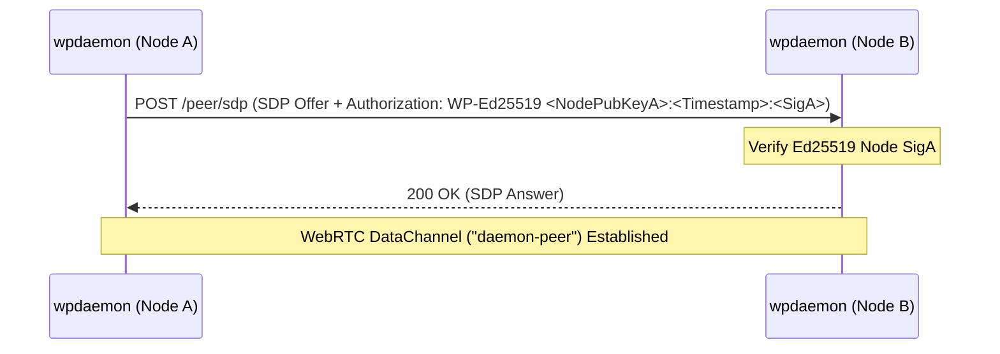

# WPIP-05: Inter-Daemon Peer Mesh Federation

`draft` `optional` `author:haruki7049`

______________________________________________________________________

## Abstract

This specification defines the **Inter-Daemon Peer Mesh Federation** protocol allowing multiple authenticated `wpdaemon` server nodes to interconnect and relay audio across distributed nodes using Ed25519 node signatures.

The key words "MUST", "MUST NOT", "REQUIRED", "SHALL NOT", "SHOULD", "SHOULD NOT", "RECOMMENDED", "MAY", and "OPTIONAL" in this document are to be interpreted as described in [RFC 2119](https://www.ietf.org/rfc/rfc2119.txt).

______________________________________________________________________

## 1. Node Identifiers & Cryptographic Identity

Each `wpdaemon` instance MUST maintain a unique Ed25519 keypair:

- **Node Identity**: A daemon's identity is represented by its 32-byte Ed25519 Public Key.
- **`node_id` (64-bit)**: Truncated 8-byte LE uint64 derived from the daemon's Ed25519 Public Key.
- **Node Collision Prevention**: Every daemon in a mesh network MUST have a distinct keypair and `node_id`.

______________________________________________________________________

## 2. Signed Interconnection Handshake

1. **Signed Handshake**: Nodes configured with peer URLs (`--peer <URL>`) MUST issue an HTTP `POST /peer/sdp` containing an SDP Offer and a valid Ed25519 Authorization header (`Authorization: WP-Ed25519 <NodePubKeyHex>:<Timestamp>:<SignatureHex>`).
1. **Verification**: Receiving nodes MUST verify node signatures and reject unauthorized peer connection requests with `401 Unauthorized`.
1. **Dedicated DataChannel**: Authenticated nodes MUST establish a WebRTC DataChannel labeled `"daemon-peer"` for node-to-node relaying.

______________________________________________________________________

## 3. Audio Relay & Loop Prevention

### 3.1 Relay Procedure

When Node A receives audio from a local client to relay into the mesh:

- Node A MUST format the packet as `PeerTargetedAudio` (`0x04`).
- Node A MUST set `origin_node` to its own `node_id` (Node A).

### 3.2 Loop Prevention Rule

When Node B receives a `PeerTargetedAudio` (`0x04`) packet:

1. Node B MUST inspect `origin_node`.
1. If `origin_node == my_node_id`, Node B MUST **immediately drop the packet** to prevent infinite packet looping in cyclic mesh topologies.
1. If `origin_node != my_node_id`, Node B MUST convert the packet to `ServerTargetedAudio` (`0x03`) and deliver it to matching local clients.
