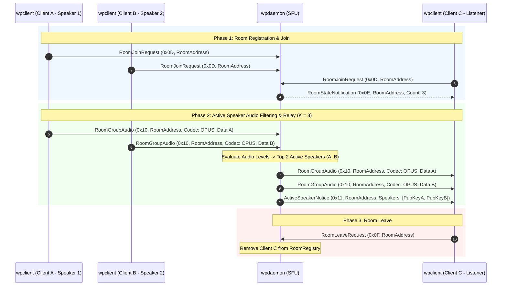

# WPIP-08: Group Call & SFU Extension

`draft` `optional` `author:haruki7049`

______________________________________________________________________

## Abstract

This specification defines an optional extension for `wpdaemon` and `wpclient` implementations to support **Group Calls** and **Selective Forwarding Unit (SFU)** audio routing.

By introducing cryptographic group identifiers (`RoomAddress`), server-side active speaker selection (Top-$K$ audio filtering with $K=3$), and multicast relay across daemons, this extension enables scalable multi-participant voice rooms (3 to 1,000+ participants) while bounding client bandwidth to a constant limit.

The key words "MUST", "MUST NOT", "REQUIRED", "SHALL", "SHALL NOT", "SHOULD", "SHOULD NOT", "RECOMMENDED", "MAY", and "OPTIONAL" in this document are to be interpreted as described in [RFC 2119](https://www.ietf.org/rfc/rfc2119.txt).

______________________________________________________________________

## 1. Cryptographic Group Identity (`RoomAddress`)

In WPIP-08, multi-participant voice sessions are identified by a 32-byte binary `RoomAddress`:

- **Binary Representation**: A `RoomAddress` MUST be a fixed-length 32-byte array (`[u8; 32]`) corresponding to the SHA-256 digest of the host's Ed25519 Public Key concatenated with a room identifier string.
- **Host Control**: The client whose Ed25519 key was used to derive the `RoomAddress` is designated as the **Room Host** and MAY issue room moderation commands.

______________________________________________________________________

## 2. Selective Forwarding Unit (SFU) Architecture

`wpdaemon` nodes adopting WPIP-08 MUST operate as a Selective Forwarding Unit (SFU) for group audio routing:

### 2.1 Bandwidth Bounding via Top-$K$ Active Speaker Selection

To prevent bandwidth explosion in large rooms ($N$ participants), `wpdaemon` MUST enforce active speaker selection:

- **Top-$K$ Limit**: `wpdaemon` MUST NOT forward audio streams from more than **$K = 3$ concurrent active speakers** to room listeners at any single instant.
- **Audio Level Evaluation**: `wpdaemon` MUST inspect audio frame energy (RMS or Opus volume metadata) to identify the top 3 loudest active speakers.
- **Payload Dropping**: Audio packets originating from participants outside the top $K$ active speakers MUST be dropped at the daemon layer to conserve downstream bandwidth.
- **Constant Downstream Bandwidth**: This mechanism guarantees that regardless of room size ($N = 10$ or $N = 1,000$), each client receives at most 3 simultaneous Opus audio streams ($\\sim 192\\text{ kbps}$ maximum downstream bitrate).

### 2.2 Multicast Inter-Daemon Relay

When room participants are connected across multiple `wpdaemon` nodes in a peer mesh (WPIP-05):

- A daemon node MUST relay at most **one copy** of a `RoomGroupAudio` packet per active speaker to peer daemon nodes.
- Receiving daemon nodes MUST fan out the audio payload locally to all connected clients registered in that room.

______________________________________________________________________

## 3. Packet Types and Wire Formats

WPIP-08 introduces dedicated DataChannel packet tags (`0x0D` through `0x11`):

| Tag (Hex) | Packet Name | Sender | Receiver | Fixed Length | Description |
| :---: | :--- | :---: | :---: | :---: | :--- |
| `0x0D` | `RoomJoinRequest` | Client | Daemon | 33 Bytes | Request to join a group room |
| `0x0E` | `RoomStateNotification` | Daemon | Client | 37 Bytes | Room state update (participant count) |
| `0x0F` | `RoomLeaveRequest` | Client | Daemon | 33 Bytes | Request to leave a group room |
| `0x10` | `RoomGroupAudio` | Client | Daemon / Client | 34 + N Bytes | Group audio packet tagged with `RoomAddress` |
| `0x11` | `ActiveSpeakerNotice` | Daemon | Client | 33 + 32×K Bytes | Notification of top active speaker addresses |

### 3.1 Detailed Byte Layouts

#### `RoomJoinRequest` (`0x0D`) / `RoomLeaveRequest` (`0x0F`)

```text
+-------------------+-----------------------+
| Tag (1b: 0x0D/0F) | RoomAddress (32b raw) |
+-------------------+-----------------------+
```

#### `RoomStateNotification` (`0x0E`)

```text
+-------------------+-----------------------+------------------------+
| Tag (1b: 0x0E)    | RoomAddress (32b raw) | ParticipantCount (4b)  |
+-------------------+-----------------------+------------------------+
```

#### `RoomGroupAudio` (`0x10`)

```text
+-------------------+-----------------------+--------------------+--------------------+
| Tag (1b: 0x10)    | RoomAddress (32b raw) | Codec ID (1b: u8)  | Audio Payload (...) |
+-------------------+-----------------------+--------------------+--------------------+
```

#### `ActiveSpeakerNotice` (`0x11`)

```text
+-------------------+-----------------------+---------------------------------------+
| Tag (1b: 0x11)    | RoomAddress (32b raw) | Active Speaker Addresses (32b × K)    |
+-------------------+-----------------------+---------------------------------------+
```

______________________________________________________________________

## 4. Group Call Lifecycle & Sequence Diagram


