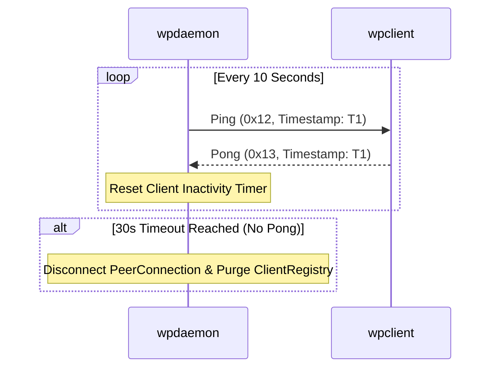

# WPIP-09: Connection Keep-Alive & Session Health Check

`optional` `author:haruki7049`

______________________________________________________________________

## Abstract

This specification defines an optional extension for `wpdaemon` and `wpclient` implementations to support **Heartbeat Keep-Alive** and **Session Health Checking**.

By transmitting periodic `Ping` (`0x12`) and `Pong` (`0x13`) packets over established WebRTC DataChannels, nodes can promptly detect silent network disconnections (e.g., sudden Wi-Fi loss or unannounced client process crashes) and purge stale entries from `ClientRegistry`.

The key words "MUST", "MUST NOT", "REQUIRED", "SHALL", "SHALL NOT", "SHOULD", "SHOULD NOT", "RECOMMENDED", "MAY", and "OPTIONAL" in this document are to be interpreted as described in [RFC 2119](https://www.ietf.org/rfc/rfc2119.txt).

______________________________________________________________________

## 1. Keep-Alive Timers & Parameters

Implementations adopting WPIP-09 MUST enforce the following default timing parameters:

- **Ping Interval**: `wpdaemon` SHOULD transmit a `Ping` (`0x12`) packet to each active client every **10 seconds**.
- **Pong Timeout**: If a client fails to respond with a `Pong` (`0x13`) packet within **30 seconds** (3 missed pings), `wpdaemon` MUST terminate the PeerConnection and purge the client's entry from `ClientRegistry`.

______________________________________________________________________

## 2. Packet Types and Wire Formats

WPIP-09 introduces heartbeat packet tags (`0x12` and `0x13`):

| Tag (Hex) | Packet Name | Sender | Receiver | Fixed Length | Description |
| :---: | :--- | :---: | :---: | :---: | :--- |
| `0x12` | `Ping` | Daemon / Client | Client / Daemon | 9 Bytes | Heartbeat query packet containing a u64 timestamp |
| `0x13` | `Pong` | Client / Daemon | Daemon / Client | 9 Bytes | Heartbeat response packet echoing the u64 timestamp |

### 2.1 Byte Layouts

```text
+-------------------+-----------------------+
| Tag (1b: 0x12/13) | Timestamp (8b: u64 LE)|
+-------------------+-----------------------+
```

______________________________________________________________________

## 3. Heartbeat Sequence Diagram


